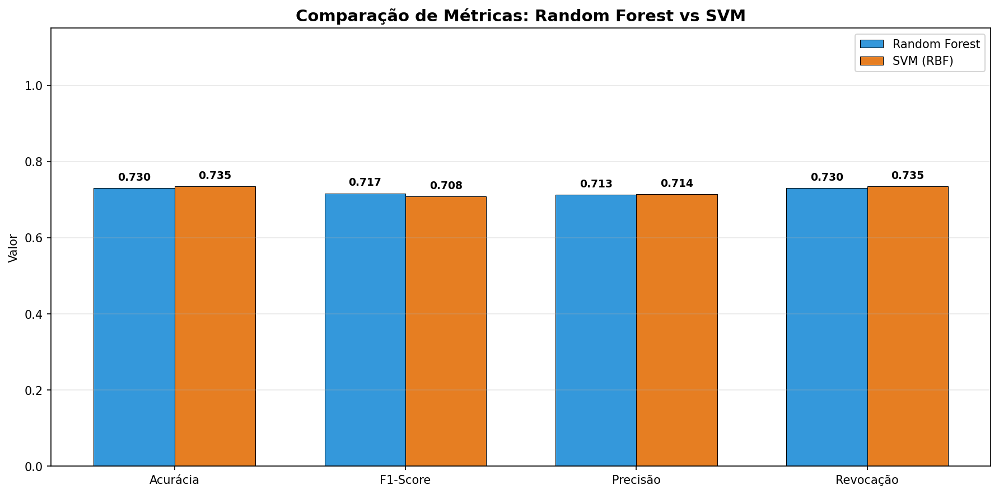
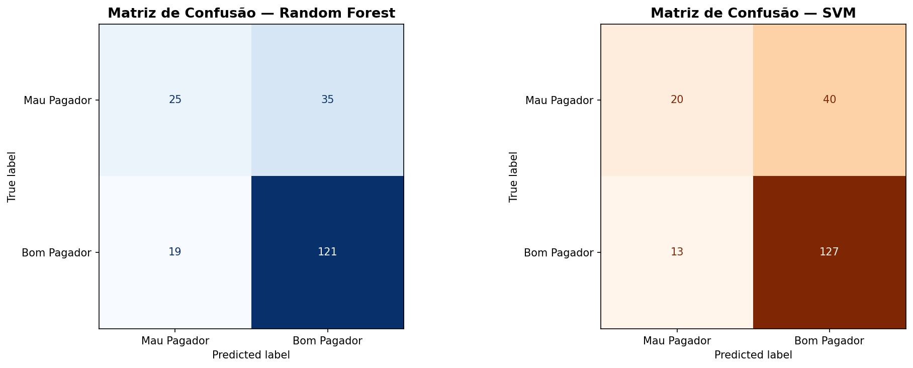

# Previsão de Aprovação de Crédito com Machine Learning

> Disciplina de Inteligência Artificial — Professor Munif — Unicesumar 2026

## Integrantes

| Nome | RA |
|------|----|
| Matheus Felipe Campioto Catenacci | 22014137-2 |
| André Felipe Ferrari de Azevedo | 22120196-2 |

---

## Resumo do Projeto

### Contextualização
A concessão de crédito é uma das atividades mais críticas do setor financeiro. Conceder crédito a um cliente de alto risco pode gerar prejuízos significativos, enquanto negar crédito a um bom pagador representa perda de receita. A inteligência artificial permite automatizar e tornar esse processo mais preciso e justo.

### Problema
Como prever se um cliente será um bom ou mau pagador com base em suas características financeiras e pessoais?

### Hipótese
É possível construir modelos de IA capazes de classificar o risco de crédito de um cliente com acurácia superior a 70%, utilizando características como idade, valor do crédito, duração do empréstimo e histórico financeiro.

---

## Dataset

| Atributo | Valor |
|----------|-------|
| Nome | German Credit Data |
| Origem | UCI Machine Learning Repository (via OpenML) |
| Registros | 1.000 clientes |
| Distribuição | 700 bons pagadores / 300 maus pagadores |

**Atributos principais:**
- `Age` — Idade
- `Housing` — Tipo de moradia
- `Saving accounts` — Poupança
- `Checking account` — Conta corrente
- `Credit amount` — Valor do crédito
- `Duration` — Duração em meses
- `Purpose` — Finalidade do crédito
- `Risk` — Variável alvo (good / bad)

**Preparação:**
- Conversão de variáveis categóricas com `LabelEncoder`
- Normalização com `StandardScaler`
- Divisão: 80% treino (800 amostras) / 20% teste (200 amostras)
- Split estratificado com `random_state=42`

---

## Métodos de IA Utilizados

### Parte 1 — Modelo Preditivo: Random Forest
Random Forest é um método de ensemble que cria múltiplas árvores de decisão independentes e combina suas previsões por votação majoritária. É robusto contra overfitting e lida bem com dados desbalanceados.

**Parâmetros:**
- `n_estimators = 100`
- `random_state = 42`

### Parte 2 — Modelo Preditivo: SVM (Support Vector Machine)
SVM é um algoritmo supervisionado que encontra o hiperplano de maior margem que separa as classes. Com o kernel RBF (Radial Basis Function), captura relações não-lineares nos dados.

**Parâmetros:**
- `kernel = 'rbf'`
- `C = 1.0`
- `gamma = 'scale'`
- `random_state = 42`

> Ambos os modelos foram treinados nas mesmas condições: mesmo split 80/20, mesmo `StandardScaler` e mesmo `random_state=42`, garantindo uma comparação justa.

### Parte 3 — Modelo Descritivo: K-Means Clustering
K-Means é um algoritmo de agrupamento não supervisionado que segmenta os clientes em grupos com características similares, sem usar a variável alvo. O Método do Cotovelo determinou `K=3` como número ideal de clusters.

---

## Avaliação dos Modelos

### Comparação: Random Forest vs SVM

| Métrica | Random Forest | SVM (RBF) |
|---------|:-------------:|:---------:|
| Acurácia | 73.00% | **73.50%** |
| F1-Score | **0.7165** | 0.7082 |
| Precisão | 0.7134 | **0.7142** |
| Revocação | 0.7300 | **0.7350** |





**Análise:** Os dois modelos apresentaram desempenho equivalente neste dataset. O SVM teve acurácia levemente superior (0.5%), enquanto o Random Forest obteve F1-Score maior. Com apenas 200 amostras de teste, essa diferença não é estatisticamente significativa.

O **Random Forest é preferível para produção** por ser interpretável — é possível identificar quais features mais influenciaram cada decisão, o que é fundamental em crédito, onde a justificativa de negativas é exigida regulatoriamente.

### Random Forest — Métricas por Classe

| Classe | Precisão | Revocação | F1-Score |
|--------|:--------:|:---------:|:--------:|
| Mau Pagador | 0.57 | 0.42 | 0.48 |
| Bom Pagador | 0.78 | 0.86 | 0.82 |

### K-Means — Perfil dos Clusters

| Cluster | Maus Pagadores | Bons Pagadores | Idade Média | Crédito Médio | Duração Média | Perfil |
|---------|:--------------:|:--------------:|:-----------:|:-------------:|:-------------:|--------|
| 0 | 127 | 199 | 30 anos | R$ 2.335 | 17 meses | Jovens, créditos pequenos |
| 1 | 48 | 286 | 39 anos | R$ 2.088 | 16 meses | Menor risco — mais maduros |
| 2 | 65 | 75 | 37 anos | R$ 7.784 | 39 meses | Maior risco proporcional |

---

## Gráficos Gerados

| Arquivo | Descrição |
|---------|-----------|
| `distribuicao_risco.png` | Distribuição da variável alvo |
| `analise_exploratoria.png` | Análise de idade e crédito por risco |
| `random_forest_features.png` | Importância das features — Random Forest |
| `curva_acuracia_rf.png` | Acurácia por número de árvores |
| `matrizes_confusao.png` | Matrizes de confusão — RF e SVM lado a lado |
| `comparacao_rf_svm.png` | Comparação de métricas RF vs SVM |
| `metodo_cotovelo.png` | Escolha do K ideal para K-Means |
| `kmeans_resultados.png` | Clusters visualizados com PCA |

---

## Conclusão

O projeto aplicou três modelos de IA ao problema de risco de crédito:

**Random Forest e SVM** (supervisionados, preditivos) foram comparados diretamente pelas mesmas métricas. Ambos atingiram ~73% de acurácia, superando a hipótese inicial de 70%. As features mais relevantes foram `Duration`, `Credit amount` e `Age`.

**K-Means** (não supervisionado, descritivo) identificou 3 perfis distintos de clientes. O Cluster 2 representa o maior risco proporcional — créditos altos (R$7.784 em média) e longa duração (39 meses), com quase 1 mau pagador para cada bom pagador.

A combinação dos três modelos oferece uma solução completa: **predição automatizada (RF/SVM) + segmentação estratégica (K-Means)**.

---

## Como Executar

1. Acesse o [Google Colab](https://colab.research.google.com)
2. Faça upload do arquivo `trabalho_ia_credito_att.ipynb`
3. Execute todas as células em ordem (`Ctrl+F9`)
4. Os gráficos e modelos serão gerados automaticamente
5. O dataset é carregado automaticamente via OpenML — não é necessário upload do CSV

---

## Modelos Treinados

Os modelos são salvos automaticamente ao executar o notebook:

| Arquivo | Descrição |
|---------|-----------|
| `modelo_random_forest.pkl` | Modelo Random Forest treinado |
| `modelo_svm.pkl` | Modelo SVM (RBF) treinado |
| `modelo_kmeans.pkl` | Modelo K-Means treinado |
| `scaler.pkl` | StandardScaler ajustado ao treino |

---

## Estrutura do Repositório

```
├── trabalho_ia_credito_att.ipynb   # Notebook principal
├── german_credit_data.csv          # Dataset (referência local)
├── modelo_random_forest.pkl        # Modelo treinado (gerado pelo notebook)
├── modelo_svm.pkl                  # Modelo treinado (gerado pelo notebook)
├── modelo_kmeans.pkl               # Modelo treinado (gerado pelo notebook)
├── scaler.pkl                      # Scaler (gerado pelo notebook)
├── comparacao_rf_svm.png           # Gráfico comparativo RF vs SVM
├── matrizes_confusao.png           # Matrizes de confusão
├── distribuicao_risco.png          # Distribuição da variável alvo
├── analise_exploratoria.png        # Análise exploratória
├── random_forest_features.png      # Importância das features
├── curva_acuracia_rf.png           # Curva de acurácia RF
├── metodo_cotovelo.png             # Método do cotovelo K-Means
├── kmeans_resultados.png           # Resultados K-Means
└── README.md                       # Este arquivo
```
